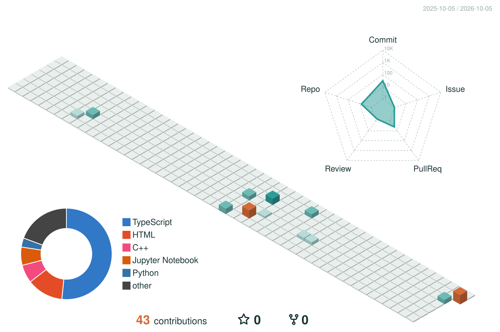

### Hi, I'm Anastasia 👋

I turn ideas into useful products — from web platforms and APIs to data-driven experiments.

## Tech I work with

## A quick look at my GitHub

## My contributions in 3D

Generated from my real GitHub activity and refreshed every day.

